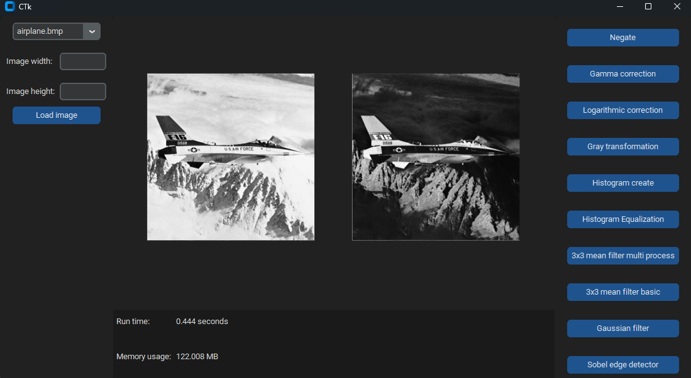

<br />
<div align="center">
  <h3 align="center">Computer Image Processing Project</h3>

  <p align="center">
    A Python-based application for applying various image filters and transformations with real-time performance monitoring.
</div>

## About The Project

This project implements a desktop application for image manipulation using Python and the Tkinter GUI framework. The application supports several essential image processing techniques, allowing users to transform images with customized filters and monitor processing performance.

### Key Features

- **Image Negation**: Inverts color values for visual inversion.
- **Gamma Correction**: Adjusts image brightness using a custom gamma factor.
- **Sobel Edge Detection**: Identifies image edges using the Sobel operator.
- **Parallel Mean Filtering**: Applies mean filtering using parallel processing for efficiency.
- **Performance Monitoring**: Tracks runtime and memory usage for each operation in real-time.



## Built With

- **Python**: Core language for image processing and GUI development.
- **Tkinter**: For creating a responsive graphical interface.
- **NumPy**: Efficient numerical operations and array manipulations.
- **PIL (Pillow)**: Image loading and transformation support.
- **Matplotlib**: Visualization of histograms and processed images.
- **Multiprocessing**: For enhancing performance with parallel computations.


## Installation

To set up this project locally, follow these steps:

1. **Clone this repository**:
   ```bash
   git clone https://github.com/Ponti1999/Computer_image_processing/tree/main/Photoshop
   cd Photoshop

2. Install dependencies:
   ```bash
    pip install -r requirements.txt

3. Using the GUI
-------------
1.  **Run the application**:
    ```bash
    python main.py

2.  **Using the GUI**:

    -   **Select an Image**: Choose an image from the dropdown menu.
    -   **Set Image Dimensions (optional)**: Enter the width and height if needed.
    -   **Apply Filters**: Click on any of the transformation buttons (e.g., "Negate", "Gamma Correction") to see the result in real-time.
    -   **Performance Monitoring**: Check the displayed runtime and memory usage after each operation.
