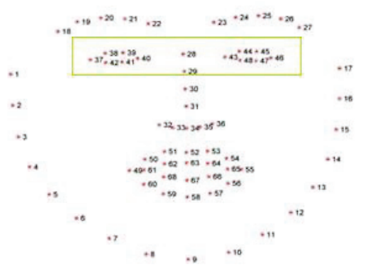
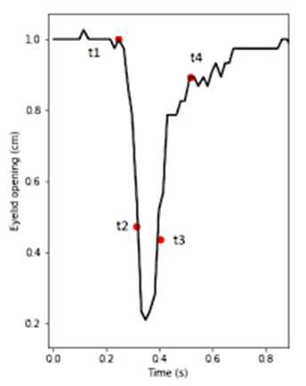
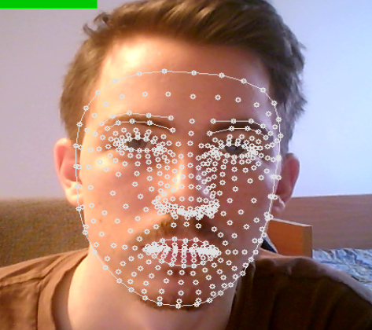
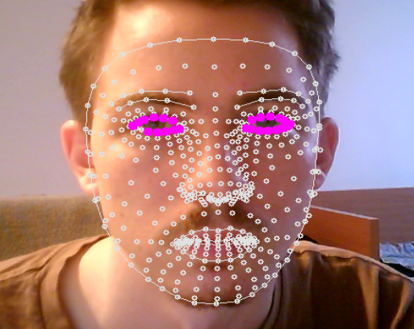
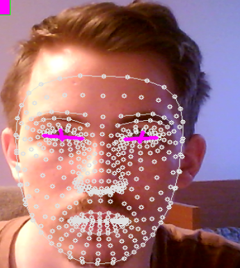
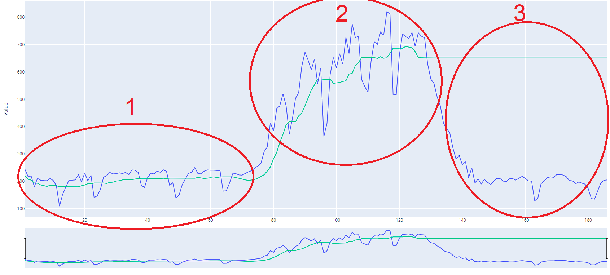
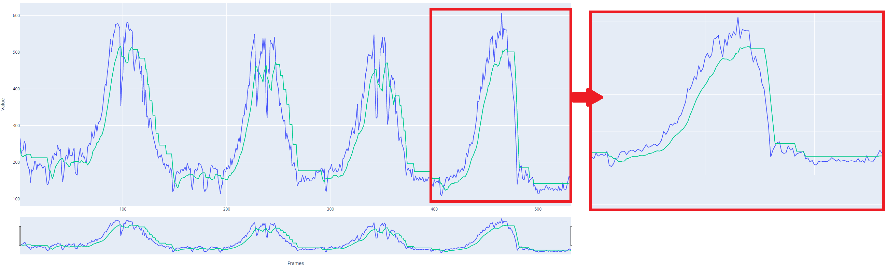

# Ez a féléves feladatom dokumnetációja.
Az első felében magyarul, majd a második felében angolul. </br>
Az újabb és frissebb dokumentáció angolul található meg [itt az angol résznél](#english-version).

# This is my Semester Assignment documentation.
In the first section it is in Hungarian, then in the second section it is in English. </br>
The newer and fresher documentation can be found in English [here in the English section](#english-version).

</br>

---------------------------------------------------------------------------------------------------

# Magyar dokumentáció

## Bevezetés
&nbsp;&nbsp;&nbsp;&nbsp;A feladatom kitalálása során törekedtem arra, hogy akár a hétköznapokban is felhasználható legyen és fejlesztések útján akár a saját mindennapjaimba is integrálni lehessen a későbbiekben.

&nbsp;&nbsp;&nbsp;&nbsp;Az általam kitalált feladat egy olyan szoftver írása, amely az eszközön elérhető kamerán keresztül vizsgálja az eszközt használó személynek a fáradsági szintjét a pislogások számából következtetve.

&nbsp;&nbsp;&nbsp;&nbsp;  Mint diák és munkavállaló, aki az idejének jó részét a számítógép előtt tölti, észleltem, hogy hajlamosabbá válok figyelmen kívül hagyni a fáradságra utaló jeleket. A fáradság mértékének növekedésével a produktivitás szintje is csökken, amit munka során jobb elkerülni. Ezzel a problémával véleményem szerint sok más ember is szembesült már.

&nbsp;&nbsp;&nbsp;&nbsp;A leggyakoribb elterjedése napjainkban adott felhasználású gépjárművekben találhatók meg, amik figyelik a gépjármű vezetőinek a fáradsági szintjét. Ezek a kamerák és feldolgozó egységek általában fuvarozó vagy nagyobb tömegközlekedési járművek szélvédőjén vannak jelen egy kompakt kiszerelésben, amik felhő alapú összeköttetésben is vannak a cég rendszerével külső figyelmeztetés vagy kiértékelés érdekében.

## A feladat
&nbsp;&nbsp;&nbsp;&nbsp;Az általam kitalált és megalkotandó szoftver jelen esetemben a számítógéphez kötött webkamera élő képe alapján detektálna arcot és vizsgálná a pislogások gyakoriságát, az egy perc alatt megtett pislogásoknak a mennyiségét, ami 12 pislogásnak felel meg percenként. -- <cite>[High-speed camera characterization of voluntary eye blinking kinematics][1]</cite> </br>

</br>

## Továbbfejlesztési lehetőségek
&nbsp;&nbsp;&nbsp;&nbsp;Későbbiekben ez a szoftver továbbfejleszthető pislogás időhosszának figyelembevételével is, ami átlagosan 1/3 másodpercig tart.</br>
Továbbfejlesztésnél lehet vizsgálni a napszaktól vagy környezettől eltérő pislogási viselkedési normákat. Emellett figyelembe vehető az ásítás detektálása is, vagy akár a szem nyitottságának nagyságát figyelembe vevő osztályozó rendszer használata. </br>

&nbsp;&nbsp;&nbsp;&nbsp;Ezekkel a további implementációkkal szerintem egy egészen pontos rendszert lehet kapni és a rendszer tanításához elegendő lenne az, ha egy kisebb közösségben elterjedne a program használata. </br>

&nbsp;&nbsp;&nbsp;&nbsp;A laptopok esetében az alapból beépített webcamera hasznos funkciót tudna ellátni egy ilyen rendszernek a betanítására, amivel a gépjárművekbe való implementálás esetén akár életmentő is lehet.  </br>

 </br>

## Megvalósítási feltételek
&nbsp;&nbsp;&nbsp;&nbsp;A rendszer megvalósításához tisztában kell lenni a felépítéséhez szükséges lehetőségekkel és limitációkkal. Limitáció alatt értendő az, hogy a kamerának kellő rálátást kell biztosítani a felhasználó a szemeire / arcára és az integrált funkciók függvényében akár a részletes, magas felbontású és magas FPS melletti üzemelés szükségelhetik. </br>

&nbsp;&nbsp;&nbsp;&nbsp;Észlelési fázishoz több módszernek az ötvözetét szokták használni. Ebben az esetben használható a Haar Cascade algoritmus, integrált kép, az AdaBoost, a regressziós fák együttese módszerek és sok egyéb. Abban az esetben, ha valaki közel rendszerfüggetlen, vagy adott hardverre optimalizált, vagy általánosságba véve optimalizált rendszert szeretne alkotni akkor ezek és sok más egyéb technikák használata javaslott. </br>

&nbsp;&nbsp;&nbsp;&nbsp;Napjainkban nem feltétlenül szükséges ezeket a lépéseket végrehajtanunk és mindnek a metodikáját részleteiben ismernünk fejlesztéshez, mert publikusan elérhető mindenki számára képi osztályozási modellek. Ezek közül a számomra a legismertebbek az OpenCV és a TensorFlow. Ezek használatának az előnye, hogy előre betanított osztályozókkal rendelkeznek, mint például az arc, a szem, a száj felismerése. </br>

&nbsp;&nbsp;&nbsp;&nbsp;Az arc maszk használata során meg kell határoznunk azt, hogy a maszk mely pontjai a száj vagy a szem. Ezt különböző technikákkal meg lehet határozni ilyen például a pontfelhő adott pontértékeinek a közvetlen megadása is. Ez hasznos lehet abban az esetben, ha egy rendszert betanítani szeretnénk és nincs sok, eltérő személynek az arcáról videó anyagunk. A manuális megadással kiszűrhető a rendszer automatikus kijelölésében keletkező zajokat. </br>

 </br>

Miután megkaptuk a szem körül elhelyezkedő pontokat meg kell határoznunk a pislogás detektálásához a szemhéjtávolságokat. Érthető módon a szemhéjtávolságok változásának függvényében határozhatjuk meg a pislogás, vagy csak a zaj közötti különbséget. „Ehhez tetszőleges mennyiségű pontot fel kell venni a szemen az egyes pislogásoknak a jellemzéséhez. E pontok kiszámításához először a csukott szemeket kell lokalizálni a jel első rendű különbsége és egy adaptív küszöbérték alapján. Ezután, minden egyes észlelt hely esetében a jelet megkeressük azelőtt és a völgy után, amíg meg nem szűnik növekedni egy meghatározott értéken belül, így megkapva a t1 és tx pontokat." -- <cite>[Driver drowsiness detection: a comparison between intrusive and non-intrusive signal acquisition methods][2]</cite> </br>

 </br>

&nbsp;&nbsp;&nbsp;&nbsp; Az általam megvalósításra kerülő szoftver esetén a Python 3-at használom fel OpenCV és tkinter vagy azon más változatának egyikével. A UI elkészítéséhez fogom felhasználni a tkinter vagy annak másik változatát és az arc domborzatát pedig az OpenCV-vel dolgozom fel. A megvalósításban elsődlegesen a percenkénti pislogás gyakoriságból meghatározom a fáradságot és egy egyszerű UI-al megjelenítem a folyamat működését. Emellett ugyan azon a UI-on belül jelzek a felhasználó számára. </br>

</br>

## Megvalósítás
&nbsp;&nbsp;&nbsp;&nbsp;A megvalósított végleges verzió a [eye_blink_project.py](./src/eye_blink_project_final.py) .</br>

&nbsp;&nbsp;&nbsp;&nbsp;A megvalósítás során kellett keresnem elsősorban olyan könyvtárakat, előre megírt programot, ami képes az arc és/vagy a szemek detektálására. Az általam választott könyvtár az opencv-python volt, mert a legtöbb dokumentáció és példa program ezt használta, emelett lehetőséget nyújt az arc azon elemeinek a detektálásához, amik a későbbi továbbfejlesztés során szükségesek lehetnek. </br>

A legelső ilyen implementációm az OpenCV-ből a FaceMashDetector volt, aminek a használata webcamera esetén a következőképpen néz ki: </br>
 </br>
</br>

Ezután a FaceMashDetector-t kiegészítettem a szemek detektálásával. Ebben az esetben mindkét szemnél található pontokat meg kell adni, hogy a szemhéjtávolságot meg tudjuk határozni. </br>
Ennek az implementálása után megjelenítettem a meghatározott szem körüli pontokat debuggulos és jobb vizuális megjelenítés érdekében, ami a következőképpen néz ki: </br>

</br>

### Első verzió
&nbsp;&nbsp;&nbsp;&nbsp;A legelső verzió során az alapgondolat az volt, hogy valamilyen módon elegendő lenne mérni csak a felső szemhély és az alsó szemhély távolságát, mert ezek a távolságok a pislogás során változnak. A pislogásokat pedig a távolságok változásának a függvényében lehetne meghatározni. Ehhez nem volt másra szükségem csak megadni a szemhélyeket és a szemhélyek közötti távolságot kiszámolni egy beépített függvény felhívásának segítségével ```detector.findDistance(... , ...)[0]```. </br>

&nbsp;&nbsp;&nbsp;&nbsp;Az első pár teszetlés után hamar rájöttem, hogy ez a megoldás nem lesz elég pontos, mert a szemhélyek közötti távolság nem csak a pislogás során változik, ezért a szemek két széle közötti távolságot is meg kell határozni és szemenként ebből a két adatból egy arányt készíteni, ami már alkalmas a szemek becsukásának detektálására külön-külön. </br>
Ez a következőképpen nézett ki: </br>

 </br>
</br>

&nbsp;&nbsp;&nbsp;&nbsp;A detektáláshoz létrehoztam szemenként 1-1 tömböt, amiben hisztorikusan eltárolom a szemek nyitottsági araányainak értékeit. Figyelembe véve azt, hogy egy perc alatt 12 a pislogások -> 1 pislogás / 5 másodperc és hogy sok képkocka esetén se legyen túl sok adat tárolva a hisztorikus tömbökben, ezért a tömbök mérete 5 nagyságúak lettek. </br>

&nbsp;&nbsp;&nbsp;&nbsp;Valamint egy treshold/határérték meghatározása is szükséges, hogy mettől számít egy szem becsukottnak. A hisztorikus adatokkal, a határérték meghatározásával és a szemek adott képkockájának értékének összehasonlítása a hisztorikus adatok átlagával, már lehetett detektálni a szemek becsukását. </br>

&nbsp;&nbsp;&nbsp;&nbsp;A detektálás esetén egészen jó arányban kaptam valid eredményeket, de 3 problémával is szembesültem:
- Gyors, hirtelen pislogást a rendszer csak ritkán detektált.
- Kacsintás esetén a nyitott szem minimálisabb mértékben való becsukását a rendszer pislogásnak detektálta.
- A kamera előre, hátra való mozgás esetén a rendszer pislogási küszöbértéke beragadt és nem érzékelt tovább (nem lekezelt hiba). </br>

Ezeknek a hiba esetén nem segített a trashold érték növelése / csökkentése, mert ezáltal vagy túl érzékennyé vált vagy túlzottan a nagy változásokra reagált. </br>

#### Konklúzió
&nbsp;&nbsp;&nbsp;&nbsp;Létrehoztam egy kezdetleges rendszert, de közelsem végleges, nem elég megbízható. A tanulságokat és a fellépő hibákat levonva kellene készítenem egy olyan továbbfejlesztett változatot ebből, ami képes lekezelni az említett hibákat. </br>

</br>

### Második verzió
&nbsp;&nbsp;&nbsp;&nbsp;A célkitűzésem a második verziójának megalkotása során az volt, hogy a hibák lekezelésével egy olyan rendszert hozzak létre, ami képes a pislogásokat megbízhatóbban detektálni. Ehhez meg kellett változtatnom a kiindulási alapokat, mert a szemhélyek távolsága nem alkalmas a pislogások megfelelő detektálására. </br>

&nbsp;&nbsp;&nbsp;&nbsp;A továbbfejlesztés során inkább elmentem a szemhélyak közötti területeknek a meghatározásával, ami egy pontosabb képet tud adni jelen funció megvalósításához. Ehhez nem volt másra szükségem csak a korábban meghatározott pontok közötti területeknek a kiszámítására külön-külön. Egy beépített függvényt felhívva egyszerűen meg is lehet oldani ezt ```cv2.contourArea(r_eye_points), cv2.contourArea(l_eye_points)```. Az előző megoldáshoz hasonlóan ezeket az értékeket is historikusan tárolom, hogy legyen viszonyításom pontom a nyitott és a csokutt értékek állapotai között. </br>

&nbsp;&nbsp;&nbsp;&nbsp;Az előző megoldás implementálása esetén mindössszesen csak a hasonlítási értékek megváltoztatásával egy jóval megbízhatóbb rendszert kaptam. Ez a rendszer alaklmas a kacsintások kiszürésére (nem detektálja pislogásnak) és a rövidebb, gyorsabb pislogást is képes detektálni. </br>
A baloldali szemre vonatkozó kiértékelési értékek az alábbiakban láthatók: </br>
 </br>

1. Itt jól látható, hogy a hisztorikus adat átlaga és a tresholddal manipulált értékével jól detektálható a hirtelen lefelé kiugró értékek. </br>
2. Ennél a résznél megfigyelhető, hogy kamera felé közelítés esetén nagyobb lesz a szem területének az értéke, amit lekövet a rendszer, ezzel minden pislogást dinamikusan lekövet mozgás során. </br>
3. Itt jól észrevehető, hogy a kamerától való távolodás esetén a határérték nem követi le a szem területének a csökkenését, így a rendszer nem detektálja a pislogást többé (folytonos pislogásnak érzékeli). </br>


&nbsp;&nbsp;&nbsp;&nbsp;Erre a 3. típusú problémára azt a megoldást találtam ki, hogy távolodás esetén a hisztorikis adat tömbből pop-oljun ki egy elemet, ezzel elérve ugyan azt a hatást, mint a kamera felé közelítés esetén. </br>
A javított változatnak az értékei a következők: </br>

 </br>
</br>

&nbsp;&nbsp;&nbsp;&nbsp;Ez a megvalósítás verzió még abban különbözik, hogy az adatokat log-oltam a későbbi kielemzés és kiértékelés érdekében a logging-al. Az értékek log-olásának feldolgozásához írtam egy külön plot script-et, ami a log fájlok alapján képes a grafikonokat kirajzolni. </br>

&nbsp;&nbsp;&nbsp;&nbsp;A grafikonok élőben való kirajzolása a program futása során látszik debuggolás és jobb megértés érdekében, de több, részletesebb adat megjelenítése és megértése érdekében elengedhetetlen volt egy külön megjelenítési forma is. </br>

&nbsp;&nbsp;&nbsp;&nbsp;Végső lépésként pedig beleraktam plusz egy számlálót és a time függvényt, ami figyeli, hogy 60 másodperc alatt megvolt e a legalább 12 pislogás és ha nem akkor jelez a rendszer. A jelzés jelen formájában egy előre kiválasztott mp3 fájl lejátszása (alrm.mp3). </br>

</br>

#### Konklúzió
&nbsp;&nbsp;&nbsp;&nbsp;A program jól le tudja kezelni a kivételeket, mint például a kamera felé közelítés és távolodás, a gyors pislogást, illetve a kacsintásokat is. A kacsintásokat nem detektálja pislogásnak. Ezáltal a kitűzött feladatomat és célokat elértem. </br>

</br>

### Kipróbált más megközelítések
&nbsp;&nbsp;&nbsp;&nbsp;Két másféle megközelítést próbáltam még ki a megvalósításom során. Az egyik egy betanított modell alapján való szem detekdálás. Ebben az esetben a detektálás 70+% pontosságot tudutt elérni, de az ilyan típúsú felismerésből nem voltam képes kinyerni a szem becsukásaához használható mögöttes információkat. </br>

&nbsp;&nbsp;&nbsp;&nbsp;A másik megközelítés az előzőhöz nagyon hasonló volt, ahol a detektálást egy általam tanított modellel végeztem volna el, de címkézett adat hiányában nem tudtam megvalósítani az előre betanítást. A valós időben való tanulása esetén pedig nem jól hasznosítható a tudása, mert nagyon sok idő szükséges neki nagyon kis siker eléréséhez is.</br>

</br>

### Továbbfejlesztési lehetőségek
&nbsp;&nbsp;&nbsp;&nbsp;A jelenlegi programomat tovább lehet fejleszteni a következőkkel: </br>
- A pislogás érzékelésekor is létre lehetne hozni egy hisztorikus tömböt a mégbiztosabb validáláshoz. </br>
- A pislogás számolásánál figyelembe lehetne venni azt, hogy azért nem érte e el a 12 minimumut, mert ténylegesen elaludt a felhasználó vagy csak folyton nyitvatartja a szemét. </br>
- A pislogás számlálásnál meg lehetne határozni különböző szinteket, hogy milyen "kategóriába tartozik pl.: túl gyakori pislogás = ébren próbálja tartani magát, de fáradt / ... . </br>
- A statikusan beírt maszk pontok helyett egy dinamikusabb szem pontjainak megtalálása / szem detektálási módszer használata. </br>
- 1 arc helyett több különböző arc detektálása, ahol az egyéneknél külön-külön méri a fáradság szintjét. </br>

</br>

## Hivatkozások
[1]: https://doi.org/10.1098/rsif.2013.0227 "K.-A. Kwon, R. J. Shipley, M. Edirisinghe, D. G. Ezra, G. Rose, S. M. Best és R. E. Cameron, „National Library of Medicine,” Journal of the Royal Society Interface, %1. kötet10, %1. szám85, p. 20130227, 06 08 2013."
1: K.-A. Kwon, R. J. Shipley, M. Edirisinghe, D. G. Ezra, G. Rose, S. M. Best és R. E. Cameron, „National Library of Medicine,” Journal of the Royal Society Interface, %1. kötet10, %1. szám85, p. 20130227, 06 08 2013.

[2]: https://ieeexplore.ieee.org/document/8611704 'L. Oliveira, J. S. Cardoso, A. Lourenço and C. Ahlström, "Driver drowsiness detection: a comparison between intrusive and non-intrusive signal acquisition methods," 2018 7th European Workshop on Visual Information Processing (EUVIP), Tampere, Finland, 2018, pp. 1-6, doi: 10.1109/EUVIP.2018.8611704.'
2: L. Oliveira, J. S. Cardoso, A. Lourenço and C. Ahlström, "Driver drowsiness detection: a comparison between intrusive and non-intrusive signal acquisition methods," 2018 7th European Workshop on Visual Information Processing (EUVIP), Tampere, Finland, 2018, pp. 1-6, doi: 10.1109/EUVIP.2018.8611704.


---------------------------------------------------------------------------------------------------

# English version

## Introduction
&nbsp;&nbsp;&nbsp;&nbsp;In the process of figuring out my task I aimed to create a program what can be used in real life. With more development it sould be capable to use it in every day of our work and able to integrate it in my own personal life later. </br>

&nbsp;&nbsp;&nbsp;&nbsp;The task I have devised is to write a program that uses a camera of the user device to detect the user's fatigue level. The program uses the detected eye blinking number and the ratio of the open eye to figure it out. </br>

&nbsp;&nbsp;&nbsp;&nbsp;As a student and an employee wo spends a good part of the day in front of the computer, I think it is important to pay attention to the fatigue level of the user. I noticed that I tend to ignore the signs of fatigue and I don't pay attention to them. As the level of fatigue increase, the efficiency of the work decreases, which is something to better to avoid in productivity mode. This is a problem I think many other people have faced, so I think it is important to pay attention to it. </br>

&nbsp;&nbsp;&nbsp;&nbsp;The most common use tuday is in the car industry (logistics or transportations), where the driver's fatigue level is monitored. These cameras and processing units are isially installed on the windsield in a compact form, which are also connected to the company's system via cloud-based links for external alert or evaluation. </br>


## The task
&nbsp;&nbsp;&nbsp;&nbsp;In my case, the software that I invented and will create would detect a face from a live image of a webcam connected directly to the computer. The program will examine the ratio of time spent with open eyes and the frequency of blinks, the number of blinks, which is in average equivalent to 12 blinks/minute  -- <cite>[High-speed camera characterization of voluntary eye blinking kinematics][1]</cite> </br>


## Further development opportunities
&nbsp;&nbsp;&nbsp;&nbsp;In the future, this software can be further developed by taking into account the duration of blinking, which lasts on average 1/3 of a second. In the case of further development, it is possible to examine the norms of blinking behavior different from the time of day or the environment. In addition, the detection of yawning can also be taken into account, or even the use of a classification system that takes into account the size of the eye opening. </br>

&nbsp;&nbsp;&nbsp;&nbsp;With these additional implementations, I think a very accurate system can be obtained, and it would be sufficient to teach the system if the use of the program spread in a small community. </br>

&nbsp;&nbsp;&nbsp;&nbsp;In the case of laptops, the built-in web camera could provide a useful function for training such a system, which could even be a lifesaver if implemented in vehicles. </br>


## Implementation conditions
&nbsp;&nbsp;&nbsp;&nbsp;To implement the system, we need to be aware of the possibilities and limitations for the detection of the face and the eyes. The limitation means that the camera must provide a clear image of the face and eyes, and depending on the integrated functions, they may even require detailed, high-resolution and high frame rate images. </br>

&nbsp;&nbsp;&nbsp;&nbsp;A combination of several methodes are usually used for the detection phase. In this case, the Haar Cascade algorithm, integrated image processing, AdaBoost, ensemble of regression trees, and the Viola-Jones algorithm are used and many others can be used. If someone wants to create a  system that is almost 100% accurate, or systmm-independent, or optimized for specific hardware / in general, then it is worth considering the use of a combination of these methods. </br>

&nbsp;&nbsp;&nbsp;&nbsp;Nowadays, it is not absolutely necessary to carry out these steps and to know the methodology of each in detail for development, because image classification models are publicly available to everyone. Of these, the best known to me are OpenCV and TensorFlow. The advantage of using them is that they have pre-trained classifiers such as face, eye, mouth recognition and more. </br>

&nbsp;&nbsp;&nbsp;&nbsp;When using the face mask, we need to determine which points on the mask are the mouth or the eyes. This can be determined using different techniques, such as directly entering the given point values of the point cloud. This can be useful in the event that we want to get access to specific part of the face and we do not have video material of the faces of many different people to train a model from zero. Manual input can be used to filter out the noise generated by the system's automatic selection. </br>

 </br>

&nbsp;&nbsp;&nbsp;&nbsp;After obtaining the points located around the eyes, we need to determine the eyelid distances for blinking detection. Understandably, we can determine the difference between blinking or just noise depending on the changes in the eyelid distances. "For this, any number of points on the eye are taken to characterize each blink. To calculate these points, the closed eyes must first be localized based on the first-order difference of the signal and an adaptive threshold. Then, for each detected location, the signal is searched for before and after the valley until it stops growing within a specified value, thus obtaining the points t1 and tx." -- <cite>[Driver drowsiness detection: a comparison between intrusive and non-intrusive signal acquisition methods][2]</cite> </br>

 </br>

&nbsp;&nbsp;&nbsp;&nbsp;In the case of the software I implement, I use Python 3 with OpenCV and tkinter or one of its other versions. I will use tkinter or another version of it to create the UI, and I will process the topography of the face with OpenCV. In the implementation, I primarily determine the fatigue from the frequency of blinking per minute and display the operation of the process with a simple UI. In addition, I sign for the user within the same UI.

## Megvalósítás
&nbsp;&nbsp;&nbsp;&nbsp;The final version of the implementation is the [eye_blink_project.py](./src/eye_blink_project_final.py) .</br>


##


##
